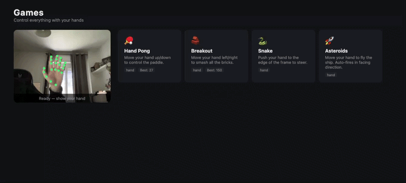

# OnlyHand

Hand tracking platform — Python CLI demos + browser game hub, all powered by MediaPipe. No GPU required.



---

## What's inside

| Layer | What it does |
|-------|-------------|
| `basics/` | Python scripts: real-time hand/face/object detection via webcam |
| `web/` | Vite SPA with 5 hand-controlled games (Pong, Breakout, Snake, Fruit Slash, Asteroids) |
| `models/` | Pre-trained MediaPipe + TFLite models (hand, face, object) |

---

## Quick start

### Python demos

```bash
# Create and activate venv (first time)
python -m venv .venv
.venv/Scripts/Activate.ps1        # Windows
source .venv/bin/activate          # macOS/Linux

pip install opencv-python mediapipe

# Run any demo
python basics/handTracking.py
python basics/gestureCapture.py
python basics/facesLiveRecognition.py
python basics/completeCountFinger.py
python basics/simpleCountFinger.py
python basics/objectStaticRecognition.py   # uses images/dog.webp, no webcam
```

Press `ESC` to quit any live webcam script.

### Web game hub

```bash
cd web
npm install        # first time only
npm run dev        # http://localhost:5173
```

Node 22.11+ required (Vite 5). Build: `npm run build` → output in `web/dist/`.

---

## Python scripts

All live scripts use MediaPipe's `LIVE_STREAM` mode — each frame is sent asynchronously and results are read in the main loop.

| Script | Description |
|--------|-------------|
| `handTracking.py` | 21-landmark hand skeleton, drawn as green dots |
| `gestureCapture.py` | Pre-trained gesture classifier (thumbs up, peace, OK, etc.) up to 2 hands |
| `simpleCountFinger.py` | Index finger up/down → binary 0/1 toggle |
| `completeCountFinger.py` | 4 fingers → binary 0–15 counter |
| `facesLiveRecognition.py` | BlazeFace real-time detection with 6 keypoints |
| `objectStaticRecognition.py` | EfficientDet on `images/dog.webp` |
| `openWebCam.py` | Bare webcam preview (OpenCV only) |

Shared logic lives in `basics/myLibraries.py`:

- `showDotsOnLandmarks()` — draw landmarks
- `binaryCountWithFingers()` — 4-finger binary count
- `visualize()` / `visualizeFaces()` — bounding box renderers

---

## Web game hub

Vanilla JS SPA, hash routing, no framework.

```
src/
├── main.js              # Route registration + startRouter()
├── router.js            # Hash router (~30 lines, zero deps)
├── core/
│   ├── camera.js        # Singleton webcam stream
│   ├── profile.js       # User profile (localStorage, schema-versioned)
│   ├── scores.js        # Per-game score persistence + cloud submit
│   ├── gameKit.js       # Shared game feel: particles, shake, countdown, WebAudio sfx, HiDPI canvas
│   ├── handCursor.js    # Point with your hand, pinch to click (menus/overlays)
│   ├── cardPreviews.js  # Animated mini-scenes on the hub cards
│   ├── icon.js          # Lucide line-icon SVG builder
│   ├── badges.js        # Gamification: XP → level curve + 13 achievement badges
│   └── backend.js       # Optional Supabase: anon auth + global leaderboard
├── input/
│   └── handInput.js     # Singleton GestureRecognizer, One-Euro filter, pinch detection
├── views/
│   ├── onboarding.js    # Camera gate → pick your tag → how-to-play (first access)
│   ├── menu.js          # Hub: webcam preview + game grid
│   ├── profileView.js   # Profile editor, avatar picker, stats, level + badges, settings
│   ├── leaderboardView.js # Hall of Fame: all-time top 10 per game, podium + your rank
│   └── gameHost.js      # Game lifecycle, pause, Game Over + leaderboard overlay
└── games/
    ├── registry.js      # { id, name, icon, description, requires, load() }
    ├── pong/            # Vertical paddle — hand y-position
    ├── breakout/        # Horizontal paddle — power-ups, endless levels
    ├── snake/           # Steer with hand offset from center
    ├── slash/           # Swipe fast to slice fruit, avoid bombs, chain combos
    └── asteroids/       # Ship follows hand, auto-fire, pinch = rapid fire
```

First access walks you through: enable camera → pick your player tag (name + avatar) →
a 4-line how-to (point, pinch, pause) → the hub. Returning players land straight in.

### Games

| Game | Control | Mechanic |
|------|---------|---------|
| **Pong** | Hand Y → paddle height | Speed ramps with a cap, particle + shake juice |
| **Breakout** | Hand X → paddle position | Endless levels, power-ups (wide paddle, multiball) |
| **Snake** | Hand offset from center → steer | Progressive speed, live steering compass |
| **Fruit Slash** | Fast swipe = blade slice | Fruit arcs + gravity, combo multiplier, bombs cost a life, rare golden fruit |
| **Asteroids** | Hand → ship · **pinch = rapid fire** | Auto-fires nearest rock, asteroids split, score = kills |

All games share `core/gameKit.js`: synthesized WebAudio sfx (zero audio files), particles,
screen shake, 3‑2‑1 countdown, HiDPI canvas, Orbitron HUD. ESC pauses; losing the hand for
2 s auto-pauses, showing it again resumes. In menus and overlays a **hand cursor** appears:
point at a button and pinch to click.

### Game contract

```js
export default {
  async mount({ canvas, onHandUpdate, handState, onScore }) {
    // game setup
    return { unmount() { /* cleanup */ }, pause() {}, resume() {} };
  }
}
```

Hand state: `{ x, y, isDetected, landmarks, gesture, pinch }` — x/y normalized 0–1,
One-Euro filtered; `pinch` = thumb-index pinch with hysteresis.

### Gamification

Every finished run earns XP (score + a per-run bonus) that levels you up — the
profile shows your level bar plus **13 achievement badges** (milestones, personal
records, per-game mastery) with live progress on the locked ones. New unlocks pop
on the Game Over screen. The **Hall of Fame** (`#/board`, trophy in the nav) is the
all-time leaderboard: one tab per game, top-3 podium, ranks 4–10, and your global
rank even when you're off the board.

### Global leaderboard (optional)

Plug in a free [Supabase](https://supabase.com) project and every run is submitted to a
global per-game leaderboard (anonymous auth, RLS-guarded, rate-limited). Setup in
[`supabase/README.md`](supabase/README.md) — without it the app stays 100% local.

### Adding a game

1. Create `src/games/<id>/index.js` with the contract above.
2. Add entry to `src/games/registry.js`.

---

## Models

Stored in `models/` (Python) and `web/public/models/` (served as static assets):

| Model | Purpose |
|-------|---------|
| `hand/hand_landmarker.task` | 21-point hand skeleton |
| `hand/gesture_recognizer.task` | ASL-like gesture classification |
| `face/blaze_face_short_range.tflite` | Face detection + 6 keypoints |
| `object/efficientdet.tflite` | Object detection (COCO, 80 classes) |

All pre-trained — no training pipeline in this repo.

---

## Tech stack

| Layer | Tech |
|-------|------|
| Hand/gesture/face/object detection | [MediaPipe](https://ai.google.dev/edge/mediapipe/solutions/guide) |
| Python video + drawing | OpenCV |
| Web ML inference | `@mediapipe/tasks-vision` 0.10.35 (WASM) |
| Web bundler | Vite 5 |
| Frontend | Vanilla JS (ES modules, no framework) |
| Backend (optional) | [Supabase](https://supabase.com) — anonymous auth, Postgres + RLS leaderboard |

---

## Project structure

```
OnlyHand/
├── basics/           # Python CLI demos
├── models/           # Shared ML models
├── images/           # Test images (dog.webp)
├── landmarks-guide/  # Hand landmark reference diagram
├── web/              # Vite SPA
│   ├── public/
│   │   ├── models/   # Static copy of models/ for browser
│   │   └── wasm/     # MediaPipe Vision WASM binaries
│   └── src/          # App source
├── supabase/         # Backend schema (schema.sql) + setup guide
├── CLAUDE.md         # Dev guide
└── REFERENCES.md     # Stack documentation links
```

---

## Requirements

**Python:** `opencv-python`, `mediapipe` (CPU-only, no GPU)

**Node:** 22.11+ (Vite 5)
